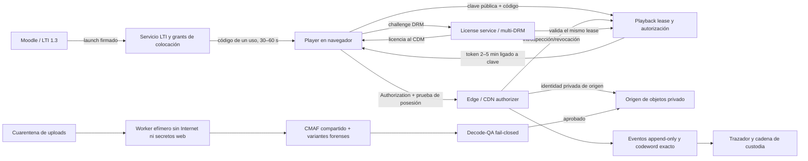
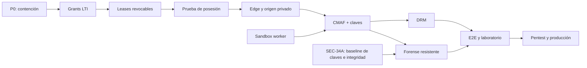

# Auditoría de seguridad del contenido y plan técnico

> **Estado:** diseño para implementación; no es una certificación ni una prueba de ausencia de vulnerabilidades. 
> **Fecha:** 2026-08-07. 
> **Código auditado:** `main` en `1db4a89` (`Merge branch 'codex/t19-admin-console'`). 
> **Worktree:** `moodleshield-security-audit`; rama `codex/security-content-audit`.

## 1. Veredicto ejecutivo

El enlace de vídeo se puede copiar y reutilizar porque el reproductor coloca en la URL un **token bearer de sesión válido durante cuatro horas**. Quien tenga esa URL puede usarla desde otro cliente hasta que caduque. Además, una petición hecha justo antes de la caducidad genera claves y enlaces de segmentos con otras cuatro horas de vida, por lo que el acceso efectivo puede acercarse a **ocho horas**.

No es un fallo aislado. Las cadenas de ataque más relevantes son:

1. El token de sesión, el token de clave y las firmas de segmentos viajan en query strings y pueden quedar almacenados en los logs de Node y nginx.
2. El navegador recibe la clave AES y todos los segmentos necesarios. Un usuario autorizado puede reconstruir el vídeo fuera del reproductor; el sistema actual es trazado disuasorio, no DRM.
3. El trazador forense documentado no es fiable, la marca A/B se elimina fácilmente recortando los bordes y la pista de audio no contiene huella. No se debe prometer atribución hasta superar una batería audiovisual fail-closed.
4. La autorización LTI confía en un UUID de material enviado como parámetro y no lo liga a una colocación concreta de Moodle. Un profesor malicioso de la misma plataforma que conozca un UUID puede intentar enlazar material de otro propietario o curso.
5. El perfil local combina secretos públicos conocidos con mecanismos de túnel. Si se expone tal cual a Internet, quien conozca IDs puede falsificar sesiones, claves y firmas. Es una condición **crítica**.
6. Vídeos y PDF no confiables se procesan con ffmpeg, ffprobe y Ghostscript en un worker con demasiados secretos, permisos, red y acceso a base de datos. Una vulnerabilidad del parser tendría un radio de impacto muy alto.
7. La versión fijada de `pdfjs-dist` está afectada por una vulnerabilidad de severidad alta publicada en 2026.
8. El PDF completo se entrega al navegador; la marca es una capa DOM eliminable. Sin cambiar el formato de entrega o sin generar una copia individual, no puede impedirse su extracción exacta.

### El límite que no puede eliminar ningún diseño web

No existe un sistema infalible para contenido que una persona autorizada puede ver u oír: siempre quedan la captura de pantalla, la grabación del sistema o una cámara externa. DRM, pruebas de posesión y marcas forenses elevan mucho el coste, reducen el reenvío de credenciales y permiten atribución, pero no eliminan el “agujero analógico”.

Por tanto, el objetivo verificable debe formularse así:

| Propiedad | Objetivo alcanzable |
|---|---|
| Copiar una URL | La ruta sola no contiene autorización y devuelve `401/403` en otro dispositivo. |
| Robar un access token ya canjeado | Su valor aislado no sirve sin la clave privada no exportable del cliente; caduca en 2–5 minutos y es revocable. El bootstrap previo tiene un riesgo residual separado. |
| Acceso al origen | Sólo el edge/CDN autenticado puede llegar al origen; cualquier ruta directa o no firmada falla cerrada. |
| Extracción de la clave de vídeo | La clave se entrega al CDM mediante DRM y no a JavaScript ni a un endpoint AES sin procesar. |
| Render por alumno | No se realiza. Se codifica un conjunto fijo de variantes una vez y sólo se compone un manifiesto ligero por identidad. |
| Filtración posterior | Se busca atribuirla con un código resistente a colusión y un decodificador validado, con umbrales de confianza explícitos. |
| Captura de pantalla/cámara | Riesgo residual inevitable; se disuade y atribuye, no se promete impedirlo. |

## 2. Alcance y método

Se revisaron manualmente:

- login y lanzamiento LTI 1.3, estado OIDC, claims, despliegues, Deep Linking y autorización de recursos;
- sesiones, tokens HMAC, endpoints HLS/PDF, playlists, claves AES, firmas y trazado;
- subida, validación y procesamiento con ffmpeg/ffprobe/Ghostscript;
- aplicación Express, cabeceras, CSP, renderizado HTML, logging y rate limiting;
- esquemas y migraciones PostgreSQL, retención, purga e integridad;
- Dockerfiles, Compose local/test/producción, nginx, CI/CD, dependencias y secretos;
- documentación y pruebas existentes, para detectar diferencias entre lo prometido y lo realmente verificado.

Comprobaciones ejecutadas sobre el commit auditado:

- `npm ci` completado;
- `npm run lint`: correcto;
- `npm test`: 121 pruebas correctas, 8 omitidas por toolchain PDF ausente en el host;
- pruebas PDF en `node:22-alpine` con qpdf, Poppler y Ghostscript: 8/8 correctas;
- `npm run test:integration` contra PostgreSQL efímero: 62/62 correctas;
- `npm audit --omit=dev`: una vulnerabilidad **alta** directa en `pdfjs-dist`;
- prueba dinámica del renderer: un `TITLE` con `<script>` llega sin escape a `processing.html`;
- prueba dinámica del logger: `req.url` conserva `?st=SECRET_TOKEN` aunque se redacte `req.query.st`.

No se hizo pentest sobre una instancia pública, análisis dinámico de Moodle real, auditoría del proveedor cloud/CDN ni ingeniería inversa completa de los codecs. No se sondeó el hostname del túnel local. Los cambios sin commit del worktree original no forman parte del baseline reproducible; se inspeccionaron como contexto, pero deberán reauditarse una vez integrados.

## 3. Controles que ya existen

El proyecto no parte de cero. Conviene conservar y endurecer estos controles:

- validación criptográfica del `id_token` LTI, nonce, estado OIDC, issuer, audience y deployment;
- sesiones firmadas y acotadas a plataforma, usuario, recurso y revisión;
- playlists por identidad con selección determinista de segmentos A/B;
- firma de ruta y expiración para segmentos en el modo `signed`;
- denegación en nginx del acceso directo a otros ficheros del árbol de medios;
- normalización de PDF con herramientas externas y comprobación de magic bytes;
- binding de los puertos oficiales de producción a loopback y volumen de medios de sólo lectura en nginx;
- ejecución no-root de app y worker en la imagen actual;
- pruebas unitarias e integración razonables para la funcionalidad cubierta.

Estos controles reducen ataques accidentales, pero no compensan las capacidades bearer, la entrega de claves al cliente, la falta de vínculo LTI con la colocación ni el aislamiento insuficiente del procesamiento.

## 4. Modelo de amenaza

### Actores considerados

1. **Alumno autorizado curioso:** usa DevTools, copia URLs, descarga playlists/segmentos/PDF y elimina capas DOM.
2. **Alumnos que colaboran:** comparan sus versiones, hacen majority vote o combinan segmentos para borrar/culpar a otro código.
3. **Profesor malicioso o cuenta de profesor comprometida:** conoce o descubre UUID, sube ficheros hostiles, llena disco/cola y crea enlaces LTI manuales.
4. **Atacante de Internet sin cuenta:** explota túneles, secretos por defecto, endpoints públicos, logs o componentes vulnerables.
5. **Atacante de infraestructura/cadena de suministro:** compromete una imagen, dependencia, runner, backup, secreto o cuenta administrativa.
6. **Operador interno:** tiene acceso legítimo a base de datos, objetos, claves o logs y lo abusa o lo pierde.

### Activos

- vídeo, audio, PDF y claves de cifrado;
- identidad del alumno, patrón forense y cadena de custodia;
- clave privada LTI, secretos de sesión/enlaces/marca, token administrativo y credenciales de base de datos;
- autorizaciones entre plataforma, deployment, curso, actividad, material y revisión;
- disponibilidad de disco, transcodificación, base de datos, CDN y aplicación.

### Fronteras de confianza

- Moodle y el navegador son externos;
- el fichero subido es hostil aunque lo suba un profesor;
- app, worker, PostgreSQL, edge y origen deben considerarse zonas separadas;
- una URL, un log y una copia del almacenamiento no son canales secretos;
- el cliente autorizado no es de confianza para proteger una clave o un PDF completo.

## 5. Reproducción conceptual del enlace compartible

1. `src/ui/assets/video-component.js:41` construye `.../hls/<revision>/index.m3u8?st=<sesión>`.
2. `src/session.js:136-141` acepta la sesión desde `Authorization` **o** desde la query `st`.
3. `src/session.js:31-35,73-114` crea un HMAC bearer, sin binding a dispositivo ni estado revocable. El valor por defecto de `SESSION_TTL_SECONDS` es cuatro horas (`src/config.js:119-121`).
4. `src/routes/hls.js:37-104` autoriza la playlist con ese bearer y devuelve un token de clave más enlaces de segmento.
5. `src/media/playlist.js:116-135` incluye `kt` y firmas de segmentos con otro TTL de cuatro horas (`src/config.js:137-138`).
6. El hijo no queda limitado por `session.expiresAt`: usando `st` justo antes de caducar se obtienen capacidades válidas casi cuatro horas adicionales.
7. Copiar el enlace conserva la identidad y el patrón A/B del donante, pero **no impide** la reproducción. La afirmación de `README.md:473` de que se protege frente a “reenviar el enlace” no coincide con el comportamiento. `README.md:478-481` sí reconoce correctamente que no es DRM.

Esto es coherente con la definición de bearer: cualquier poseedor puede usarlo. RFC 6750 recomienda no colocar estos tokens en URLs porque terminan en historial y logs, y aconseja vidas cortas y alcance limitado.

## 6. Hallazgos priorizados

| ID | Severidad | Hallazgo | Consecuencia principal |
|---|---:|---|---|
| F-01 | Crítica, condicional | Perfil local público con secretos conocidos | Falsificación de sesiones, claves, firmas y acceso administrativo si el túnel estuvo activo. |
| F-02 | Alta | Sesión bearer en URL y capacidades hijas no acotadas | Reenvío/replay durante casi 8 h en el peor momento. |
| F-03 | Alta | Tokens en logs de Node y nginx | Cualquier lector o fuga del log obtiene credenciales activas. |
| F-04 | Alta, condicional | Entrega de medios fail-open en modo `app` | Segmentos A/B accesibles sin firma si se expone directamente la app en ese modo. |
| F-05 | Alta | Autorización LTI sin colocación server-side | Acceso entre cursos/propietarios de una misma plataforma con un UUID conocido. |
| F-06 | Alta | AES-HLS no es DRM; clave en el navegador | Descarga, descifrado y reconstrucción offline por cualquier usuario autorizado. |
| F-07 | Alta | Trazado no fiable y vulnerable a recorte/colusión | No puede sostenerse una atribución ni la promesa forense actual. |
| F-08 | Alta | PDF completo y marca sólo DOM | Copia exacta del documento sin marca persistente. |
| F-09 | Alta | `pdfjs-dist` vulnerable | Posible ejecución de JavaScript al abrir un PDF malicioso bajo condiciones compatibles. |
| F-10 | Alta | Worker/parser con privilegios y límites insuficientes | RCE/SSRF/DoS con acceso amplio a secretos, DB, red y medios. |
| F-11 | Alta | Sesiones sin revocación y validación LTI incompleta | Acceso persiste tras deshabilitar plataforma; vinculaciones de lanzamiento débiles. |
| F-12 | Alta | Ausencia de cuotas y límites globales | Agotamiento de CPU, RAM, disco, cola, DB o ancho de banda. |
| F-13 | Media | Inyección HTML almacenada y CSP permisiva | XSS en flujos legacy/inconsistentes o combinado con el fallo de autorización. |
| F-14 | Media-alta | Purga destruye evidencia e integridad parcial | Una filtración antigua puede quedar imposible de trazar; manipulación de igual tamaño pasa el fingerprint. |
| F-15 | Media-alta | Mínimo privilegio, TLS DB y supply chain insuficientes | Mayor radio de impacto y despliegue de artefactos vulnerables/no verificables. |
| F-16 | Baja | Errores internos en readiness y detalles operativos | Divulgación de información útil para reconocimiento. |

La severidad combina impacto y explotabilidad en la configuración oficial. F-01 se vuelve crítica sólo si el perfil local conocido se expone o se expuso públicamente.

## 7. Detalle de hallazgos y correcciones

### F-01 — Perfil local expuesto con secretos deterministas

**Evidencia.** `infra/local/compose.yml:22-38` usa `NODE_ENV=development`, secretos HMAC conocidos y `LTI_ADMIN_TOKEN=local-admin`. El mismo Compose y la documentación ofrecen exposición mediante túnel. `infra/local/.env:14-15` contiene una `PUBLIC_URL` HTTPS no local. `src/config.js:76-80` también tiene fallbacks deterministas en desarrollo. El generador actual no cubre adecuadamente todos los secretos administrativos.

**Ataque.** Si ese host estuvo activo, el conocimiento del repositorio y de IDs observables permite fabricar `st`, `kt` y firmas; el token administrativo conocido facilita enumeración/configuración de plataformas. El `WATERMARK_SECRET` conocido permite predecir patrones y debilita cualquier evidencia forense de ese intervalo.

**Corrección.** El proceso debe abortar si `PUBLIC_URL` no es loopback y detecta cualquier secreto por defecto, `NODE_ENV=development`, `MEDIA_DELIVERY=app` o token administrativo débil. El perfil de túnel debe crear secretos aleatorios fuera del repositorio y no publicar el panel admin. Rotar inmediatamente si hubo exposición.

### F-02 — Bearer reutilizable y escalada de TTL padre-hijo

**Evidencia.** Se detalla en la sección 5. No hay clave de dispositivo, nonce por petición, sesión server-side, revocación ni límite `exp_hijo <= exp_padre`.

**Ataque.** Copiar la URL basta para reproducir desde otro navegador. Una petición de playlist al final de la cuarta hora crea una clave y segmentos útiles casi hasta la octava. Como el replay conserva el `sub` y el codeword del donante, una copia robada también puede incriminar a la persona cuya URL se filtró: el patrón por sí solo no prueba quién hizo la copia.

**Corrección inmediata.** En hls.js mover la sesión a `Authorization`; para HLS nativo usar un ticket opaco de un uso y 30–60 s hasta disponer de FairPlay/edge compatible. Calcular siempre `childExp = min(parentExp, now + childTTL)`. Acortar a minutos las capacidades de segmentos sólo cuando exista rolling/refresh/authorizer que mantenga un VOD largo; hasta entonces se acotan al padre sin romper reproducción. Añadir `Cache-Control: no-store` al HTML de launch/player y `Referrer-Policy: no-referrer`. Las firmas `secure_link` siguen en query durante esta transición, pero no se registran. Es contención, no solución completa.

**Corrección objetivo.** Código de intercambio de un solo uso, lease server-side revocable y access token ligado por prueba de posesión a una clave WebCrypto no exportable. El edge debe comprobar token, prueba, lease, recurso, revisión y ruta.

### F-03 — Credenciales en observabilidad

**Evidencia.** `src/logger.js:4-15` intenta redactar `req.query.st`, `kt` y `md5`, pero `pino-http` conserva `req.url` con la query completa. Una prueba local serializó literalmente `?st=SECRET_TOKEN`. `infra/nginx/templates/default.conf.template:21` usa el formato `combined`, cuyo `$request` incluye la query. `docs/tasks/backlog/T16-observabilidad-hardening.md` ya reconoce parte del riesgo.

**Ataque.** Logs de aplicación, proxy, agregador, backup o soporte contienen sesiones, claves y enlaces firmados todavía válidos, además de payloads base64 con datos personales.

**Corrección.** El destino final no pone autoridad reutilizable en URL; mientras `secure_link` todavía requiera query, su TTL es el mínimo compatible con el VOD, queda acotada al padre y jamás se registra. Registrar en Node sólo ruta/route-id, nunca `originalUrl`; en nginx usar `$uri` sin `$args`. Redactar headers de autorización, cookies y cuerpos. Separar observabilidad operacional sin identidad directa del almacén forense pseudonimizado, con acceso, base legal y retención específicos. Añadir una prueba canario que falle si un secreto aparece en logs de cualquier capa. Restringir, expirar y sanear logs históricos preservando sólo la evidencia necesaria.

### F-04 — Entrega de medios que puede fallar abierta

**Evidencia.** `MEDIA_DELIVERY` vale `app` por defecto (`src/config.js:124-138`). `assertConfigValid` sólo exige secreto cuando el valor es `signed`, pero no valida el enum ni obliga a `signed` en producción (`src/config.js:242-245`). En modo `app`, `src/app.js:85-90`, `src/media/playlist.js:132-134` y `src/routes/hls.js:146-157` publican/sirven rutas sin validación de firma.

**Ataque.** Exponer directamente el contenedor app con `MEDIA_DELIVERY=app` —o un desarrollo/túnel que evite la validación del proxy— permite pedir cualquier segmento A/B con IDs conocidos. Al poder elegir todos A o todos B, el atacante elimina la atribución al usuario original. Un valor desconocido en producción no expone bytes con el nginx oficial: la app no monta el router, genera URLs sin firma y nginx las rechaza; provoca indisponibilidad. Sigue siendo necesario validar el enum para no depender de ese efecto lateral.

**Corrección.** Enum estricto; producción sólo `edge-authenticated`; ninguna rama del router debe servir medios sin autorización. La app no debe ser enrutable desde Internet y el origen sólo debe aceptar la identidad del edge. Los tests de arranque deben demostrar que toda configuración dudosa aborta.

### F-05 — Falta un grant de colocación LTI

**Evidencia.** `src/lti/routes.js:143-169,182-190,193-219` acepta un UUID de recurso firmado dentro del lanzamiento y busca el material por plataforma. No hay una entidad server-side que ligue material, propietario, deployment, contexto y `resource_link_id`. La UI de Deep Linking filtra el catálogo, pero un parámetro custom manual no queda limitado por ese filtro.

**Ataque.** Un profesor de la misma plataforma que obtenga el UUID de otro material puede crear/modificar una actividad LTI y pedir acceso desde otro curso. La firma de Moodle prueba quién envió el UUID, no que ese UUID esté autorizado para esa colocación.

**Corrección.** Deep Linking debe crear un `resource_placement` opaco y aleatorio con plataforma, deployment, material, propietario, `created_by_sub` y política. El primer binding no puede ser sólo “first wins”: exige launch con rol Instructor, `sub == created_by_sub`, deployment+context coincidentes y confirmación explícita; entonces liga atómicamente `resource_link_id` y habilita alumnos. Una actividad/custom copiado falla; sólo un nuevo Deep Linking o flujo autenticado del propietario emite otro grant. Si Moodle no aporta `context.id`, una política explícita decide rechazo o alcance alternativo: nunca se omite silenciosamente el vínculo. No se usa el UUID bruto como autorización ordinaria.

### F-06 — Cifrado HLS con clave exportable

**Evidencia.** `src/media/transcode.js:118-137` guarda `key.bin` junto a los artefactos y crea una clave AES y un IV fijo por revisión, compartidos por A/B y reutilizados entre segmentos. `src/routes/hls.js:106-137` devuelve los bytes de esa clave a quien presente `kt`. Playlist, clave y segmentos están disponibles para el reproductor y por tanto para el usuario. Una copia/backup del árbol reúne ciphertext y clave en el mismo conjunto.

**Ataque.** Un script descarga la playlist, llama al endpoint de clave y concatena/descifra segmentos. Desactivar menú contextual o `controlsList` no cambia esta capacidad.

**Corrección.** Para contenido de alto valor, empaquetado CMAF con Common Encryption y DRM multi-plataforma: Widevine, PlayReady y FairPlay según la matriz real. La licencia se entrega al CDM tras validar el mismo lease; JavaScript no recibe la clave en crudo. KMS/licensing se separa del objeto y backup. En el modo transitorio AES, usar IV único por segmento/muestra, también entre A/B y renditions, o claves separadas; cada objeto/manifiesto transporta el IV que le corresponde. Rotar claves por grupos y validar cifrado/IV antes de publicar. DRM sigue sin impedir una cámara o una captura en clientes comprometidos.

### F-07 — Marca y trazador forense no aptos para producción

**Evidencia.** `docs/tasks/backlog/T13-trazado-forense.md` declara que el trazador empírico actual clasifica incorrectamente. `tools/trace.mjs:204-208` compara luminancias de regiones distintas, por lo que el contenido domina la señal. `src/media/transcode.js:19-36` coloca una pequeña caja blanca en bordes inferiores; un recorte la elimina y una zona clara la oculta. `src/media/transcode.js:58-80` aplica el filtro sólo a vídeo y codifica el mismo audio AAC para A/B: una extracción audio-only no contiene el patrón. `MARK_ALPHA` no se valida. `src/media/playlist.js:50-72` sólo comprueba conteo/duración/clave de las variantes, no que la marca sea decodificable. La secuencia HMAC binaria no tiene garantía de resistencia a colusión. Además, `src/routes/hls.js:52-72` captura el error de `recordView` y sirve la playlist igualmente; el `jti` desduplica eventos, por lo que un replay desde otro IP/UA puede no crear nueva evidencia.

**Ataque.** Recorte, reencodificación, escalado, cambio de gamma, desplazamiento temporal o comparación entre dos cuentas elimina/confunde la señal. Extraer sólo la locución/audio omite la marca por completo. Dos usuarios pueden combinar variantes; una inferencia incorrecta puede acusar a un tercero.

**Corrección.** Código Tardos/Nuida o equivalente con parámetros y umbral definidos; un único codeword estable por principal+revisión para evitar autocolusión; símbolos de vídeo distribuidos espacial/temporalmente y variantes de audio compartidas con watermark robusto e inaudible. Ambos se precomputan una vez, nunca por alumno. Cada revisión debe ejecutar decode-QA audiovisual sobre un corpus de transformaciones antes de pasar a `ready`. Un evento durable/outbox debe existir antes del primer byte atribuible; si no puede registrarse, la entrega falla cerrada o queda respaldada por un recibo durable del edge. El trazador usa referencias, corrige estadísticamente el número de candidatos, permite resultado “inconcluso”, reporta confianza y conserva cadena de custodia. Hasta entonces, retirar toda afirmación de atribución garantizada, incluido audio.

### F-08 — El PDF se entrega completo y sin marca persistente

**Evidencia.** `src/routes/documents.js:303-327` sirve el PDF normalizado entero o por rangos. `src/ui/assets/pdf-component.js:38-53` dibuja la identidad en DOM y el propio código reconoce que no es DRM. El cliente puede recomponer los mismos bytes y omitir la capa.

**Ataque.** DevTools, curl o un lector de rangos reconstruye el documento original sin atribución. También puede imprimirlo desde la superficie ya renderizada.

**Decisión necesaria.** Con la restricción de no renderizar por alumno sólo hay dos opciones honestas:

1. aceptar que el PDF es descargable y tratar el overlay como disuasión; o
2. no servir `document.pdf`, prerenderizar una vez páginas/tiles con alternativas A/B (o alfabeto pequeño) y componer un manifiesto por identidad. Esto mantiene el render compartido, pero pierde texto seleccionable/accesibilidad si no se diseña una vía alternativa y sigue permitiendo capturas.

Una tercera opción —PDF estampado y cacheado una vez por destinatario— da una copia persistente pero relaja expresamente la restricción de no render por alumno.

### F-09 — Vulnerabilidad alta en PDF.js y defensa web incompleta

**Evidencia.** `package.json` declara `pdfjs-dist ^5.7.284`; el lock instala 5.7.284. `npm audit --omit=dev` identifica GHSA-hq66-cqwq-w95j / CVE-2026-16633, afectando `>=5.6.83 <6.2.108`. `src/ui/assets/pdf-component.js:65-77` usa `isEvalSupported: false`, desactiva XFA y no monta `AnnotationLayer` ni `PDFScriptingManager`, controles útiles que deben conservarse. La CSP en `src/app.js:46-63` permite `script-src 'unsafe-inline'`. Además, `src/app.js:98-105` sirve la ruta vendor estable con caché de siete días e `immutable`: actualizar el paquete no reemplaza el PDF.js ya cacheado en clientes.

**Ataque.** Bajo las condiciones descritas por el advisory, un PDF malicioso puede ejecutar JavaScript al visualizarse. La normalización previa reduce superficie, pero no debe asumirse como prueba de que ninguna construcción peligrosa sobrevive.

**Corrección.** Subir como mínimo a 6.2.108 o una versión posterior revisada; conservar `isEvalSupported: false` y no incorporar AnnotationLayer/scripting manager sin un sandbox y revisión específicos. `enableScripting` no es un parámetro de `getDocument` en esta integración y pasarlo al loader sería un control ficticio. Versionar/hash-ear la URL vendor o retirar `immutable`/forzar revalidación durante el rollout, y verificar en el navegador la versión realmente cargada. Eliminar inline scripts de la aplicación, endurecer CSP, añadir un corpus PDF malicioso y convertir el audit de dependencias de severidad alta en gate de CI.

### F-10 — Procesamiento hostil sin sandbox suficiente

**Evidencia.** La subida de vídeo valida extensión, no magic/container real (`src/media/upload.js:208-216`). ffprobe/ffmpeg se ejecutan sin timeout por defecto (`src/media/run.js:13-49`, `src/media/transcode.js:39-46,124-152`), sin whitelist estricta de protocolos ni límites de duración, resolución, streams o salida. En producción app y worker comparten el bloque de secretos, credenciales DB y volúmenes RW (`infra/prod/compose.yml`). La red llamada `internal` no tiene `internal: true`.

**Ataque.** Un fichero especialmente construido puede agotar recursos, activar un bug de parser o protocolos inesperados. Una RCE en el worker tendría acceso a secretos de sesión, enlace, marca, administración/LTI, DB, red y todo el almacenamiento.

**Corrección.** Worker efímero por job o sandbox equivalente: sin Internet/egress arbitrario, con red deny-by-default y allowlist mínima a broker/object store; durante la transición puede acceder a PostgreSQL con un rol worker mínimo, o usar input/output materializados sin red. Sin secretos LTI/admin/firma, usuario/GID dedicado, rootfs read-only, `cap_drop: ALL`, `no-new-privileges`, seccomp/AppArmor, tmpfs y cuotas de CPU/RAM/PIDs/disco/tiempo. Entrada de cuarentena de sólo lectura y salida en staging único. Whitelist de protocolos, inspección de magic/container y límites antes y durante el proceso. El worker recibe trabajos por una API/cola con credencial mínima, no con el rol general de DB.

### F-11 — Validación LTI y revocación insuficientes

**Evidencia.** `src/lti/validate.js:60-149` valida claims principales, pero no liga el `target_link_uri` firmado al guardado en la iniciación, no exige `resource_link.id` para cada Resource Link launch y no aplica un esquema estricto por tipo de mensaje/contexto/rol. Cuando no hay deployments configurados pueden aprenderse automáticamente. `deployment_id` no forma parte de la sesión ni del aislamiento posterior; catálogo, carpetas, materiales y colecciones se indexan principalmente por `platform_id + owner_sub`, de modo que varios deployments de una misma registration tampoco quedan separados de extremo a extremo. El `deep_link_return_url` recibido no se limita de forma explícita a esquema/origen esperado, y el `deepLinkToken` interno de una hora usado para POSTear la respuesta no se consume. Las sesiones de colección pueden ampliar su alcance si después se añaden elementos, porque autorizan la colección mutable en vez de congelar una versión. Las sesiones ya emitidas siguen siendo criptográficamente válidas aunque la plataforma se deshabilite, porque no existe estado/revocación consultado en playback.

**Ataque.** Claims válidos pero fuera del flujo esperado pueden obtener más confianza de la debida; una credencial emitida mantiene acceso durante su vida incluso tras una respuesta operativa.

**Corrección.** Validadores por `message_type`; el target debe coincidir con el state **y** pertenecer a la allowlist de launch URIs propias registradas (origen+path exactos), porque el valor de iniciación llega por front-channel. Allowlist HTTPS separada por plataforma para el return URL, roles IMS exactos y ventana máxima de `iat`; persistir y consumir atómicamente el `jti` del `deepLinkToken` interno. Añadir grant de colocación y políticas explícitas de deployment onboarding. O bien `deployment_id` es dimensión obligatoria del ownership, tenant, catálogo, grant, sesión y todas las queries/constraints, migrando legado, o bien una `lti_platform` admite exactamente un deployment; no vale aislar sólo el grant. Definir si una colección concede una versión congelada o sólo bajas dinámicas, pero nunca altas silenciosas. Todo playback usa un lease server-side y comprueba plataforma/usuario/material/revisión activos. Deshabilitar una plataforma o material rechaza nuevas peticiones/renovaciones en minutos; no puede recuperar bytes ya descargados o en buffer.

### F-12 — DoS y abuso sin cuotas de negocio

**Evidencia.** El rate limiting visible se concentra en administración (`src/admin/routes.js:38-47`). No hay límites completos por plataforma/principal para OIDC state, uploads almacenados, jobs, duración/resolución, rangos PDF, playlists, concurrencia de stream o ancho de banda.

**Ataque.** Un profesor llena disco y cola con uploads; un cliente genera estados/logins, rangos diminutos o playlists repetidos; una sesión robada consume ancho de banda/DB; un vídeo patológico mantiene ffmpeg indefinidamente.

**Corrección.** WAF/edge más cuotas por identidad y plataforma, reservas de almacenamiento, concurrencia de upload/job, límites de rango, duración y output, rate de manifest/licencia, sesiones simultáneas y presupuesto de ancho de banda. La IP sólo es una señal auxiliar para no penalizar aulas/NAT.

### F-13 — XSS almacenado y CSP permisiva

**Evidencia.** `src/ui/render.js:30-35` hace reemplazos HTML sin escape y `src/ui/processing.html:12` inserta `{{TITLE}}` crudo. Una prueba local conservó un `<script>` literal. La CSP global permite inline. El flujo Deep Linking normal sólo publica materiales listos, por lo que el exploit directo necesita una actividad legacy/inconsistente o combinarse con la fabricación de un custom UUID de F-05.

**Ataque.** Un título controlado por profesor puede ejecutar código same-origin en una página de alumno alcanzable bajo esas precondiciones. Una XSS en el player también podría usar una clave DPoP aunque no fuera exportable, por eso CSP es parte del diseño de replay.

**Corrección.** Escape contextual por defecto; ninguna sustitución raw genérica. Scripts externos o nonces/hashes, sin `'unsafe-inline'`; Trusted Types donde haya soporte; tests con payloads en todos los campos de Moodle/DB.

### F-14 — Integridad y evidencia forense no sobreviven a la purga

**Evidencia.** `src/services/revisions.js:406-415` elimina fila y artefactos. `migrations/007_material_revisions.sql:118-121` permite que `view_event.revision_id` quede `NULL`; `tools/trace.mjs:61-104` exige la revisión y su `meta.json`. Existe `legal_hold`, pero no se encontró un flujo operativo para activarlo. `src/media/storage.js:177-193` incluye claves/playlists y nombre/tamaño de segmentos en el fingerprint, no el contenido de cada segmento; un cambio de igual tamaño puede pasar inadvertido.

**Ataque/fallo.** Una copia aparece después de purgar su revisión y ya no puede vincularse. Un operador o corrupción altera bytes sin cambiar tamaño y la verificación declarada no lo detecta.

**Corrección.** Al purgar bytes pesados conservar un tombstone forense versionado: scope, `kid`, parámetros/codeword, geometría/timing, features o referencias mínimas del decoder y enlace inmutable de eventos. Flujo real de legal hold y cold storage. Hash/Merkle de cada objeto inmutable y manifiesto firmado; verificación periódica.

### F-15 — Infraestructura y cadena de suministro

**Evidencia.** Faltan de forma consistente rootfs read-only, capabilities eliminadas, `no-new-privileges`, `pids_limit`, egress deny-by-default y roles DB separados. `src/db/index.js:20` usa TLS con `rejectUnauthorized: false` cuando se activa SSL remoto. App/worker pueden ejecutar migraciones con un rol potente; secretos viven en env y la clave privada LTI en DB/backups. Hay CodeQL y una comprobación limitada de `.env.sample`, pero no cubren toda la cadena ni consta aquí que sean gates obligatorios de promoción. Acciones y base images usan tags mutables; CI ejecuta `npm ci --no-audit`; faltan gates completos de secretos, SBOM, CVE de imagen, firma y provenance. En `.github/workflows/cd-main.yml:22-47`, checkout y `npm ci` comparten un job con `contents: write`/`packages: write` y credenciales persistidas por defecto: un lifecycle script comprometido gana un token de escritura. La promoción usa tags cortos de commit y no demuestra artefacto firmado/digest exacto. El proxy monta su configuración desde un clon del host y el CD sólo promociona app/worker, de modo que una corrección de nginx puede no llegar a producción. Backups y edge se describen como procedimientos manuales, sin prueba automática de cifrado, consistencia o restauración.

**Ataque.** Una dependencia o imagen vulnerable llega a producción; MITM contra DB remota; compromiso de un contenedor escala a todos los datos; backup expone claves; un tag mutable cambia sin revisión.

**Corrección.** Roles DB separados para app, worker y migración; TLS con CA y verificación de hostname; secret manager/KMS y `kid` versionado; medios RO para app salvo writer aislado; redes por zona. Pin por digest y actions por SHA; audit/SAST/secret scan/SBOM/CVE de imagen, firma y attestations. Construir nginx+config como artefacto inmutable y promocionarlo, junto con app/worker, por digest completo en un entorno protegido. Edge como IaC y backups cifrados, consistentes, offsite/inmutables y sometidos a restore drills.

Los permisos de ficheros compartidos deben resolverse con un GID dedicado y `0750/0640`, no con lectura mundial. Esto también aplica al servicio `prepare` observado entre los cambios no comprometidos del worktree original.

### F-16 — Divulgación operativa menor

**Evidencia.** `src/routes/health.js:22-28` devuelve detalles crudos de error DB desde readiness.

**Corrección.** Respuesta pública genérica y diagnóstico completo sólo en logs internos redactados. Limitar `/readyz` a la red del orquestador.

## 8. Arquitectura objetivo

### 8.1 Autorización y colocación

- Deep Linking crea un identificador opaco de `resource_placement`; nunca expone el UUID material como capacidad.
- El grant incluye `platform_id`, `deployment_id`, propietario/tenant, material, política de curso/contexto, estado y fechas.
- El primer launch sólo puede ligar el grant si tiene rol Instructor, su `sub` coincide con `created_by_sub`, deployment+context ya fijados por Deep Linking coinciden y el propietario confirma la actividad. El `UPDATE ... WHERE resource_link_id IS NULL` hace atómico el bind; no se confía en “el primero gana”. Hasta entonces los alumnos reciben estado pending.
- Copiar una actividad replica el custom opaco sin avisar a la herramienta: ese launch debe fallar. Sólo un nuevo Deep Linking o flujo autenticado de instructor puede clonar y emitir otro grant auditable.
- Cada claim requerido se valida por tipo de mensaje. `target_link_uri` debe coincidir con la iniciación almacenada y con la allowlist propia de origen+path; issuer, client, deployment y nonce también se ligan al flujo.

### 8.2 Bootstrap, lease y prueba de posesión

- El HTML de launch contiene sólo un código aleatorio, opaco, de un uso y 30–60 segundos; no contiene un bearer de cuatro horas ni claves.
- El player genera una clave asimétrica no exportable mediante WebCrypto y canjea código+clave pública.
- El servidor persiste un `playback_lease`: `sid`, principal compuesto, placement, recurso, revisión, thumbprint de la clave del cliente, codeword/version/`kid`, estado, expiración idle/absoluta y concurrencia.
- Emite access tokens de 2–5 minutos con `iss`, `aud`, `scope`, `nbf`, `exp`, `jti` y confirmación de clave. Cada petición lleva prueba DPoP o mecanismo equivalente con nonce de servidor en operaciones sensibles.
- Los tokens viven sólo en memoria. Nunca van en query, Local Storage, HTML persistente, logs ni eventos analíticos.
- Una plataforma/material/usuario deshabilitado o un exceso de concurrencia hace que el edge rechace nuevas peticiones/renovaciones en menos de cinco minutos. No recupera bytes ya descargados o presentes en el buffer.

DPoP no corrige XSS: código malicioso same-origin puede pedir firmas a la clave aunque no la exporte. Por eso escape, CSP estricta y aislamiento del player son requisitos previos, no extras.

### 8.3 Edge, caché y origen

- El navegador pide manifiestos/segmentos con autorización sender-constrained. El edge valida lease, ruta, revisión y que la variante solicitada corresponda al codeword.
- El manifiesto personalizado es texto pequeño, `private, no-store`, generado/caché interno por principal+revisión. No se codifica vídeo por alumno.
- Los segmentos son objetos inmutables compartidos. El CDN los cachea por path/hash de contenido, **excluyendo** token, usuario y query del cache key. La autorización se decide antes de servir el objeto cacheado.
- El origen no tiene IP pública. El edge es el único lector del data-plane; un publisher/orquestador separado tiene identidad write/promote acotada a staging/nueva versión, sin servir lecturas. App y worker no ofrecen una ruta alternativa.
- No existe un modo de producción `app` o unsigned. Un valor desconocido impide arrancar.

### 8.4 Vídeo, DRM y marca forense

- Se genera una escalera ABR CMAF una vez por revisión y un alfabeto fijo de 2–4 variantes audiovisuales por intervalo. El coste depende del alfabeto, no del número de alumnos.
- Common Encryption usa claves fuera del árbol de medios, versionadas/protegidas por KMS. El license service valida lease y política del dispositivo/CDM.
- Se decide tras un spike real la combinación Widevine/PlayReady/FairPlay, soporte en iframes de Moodle, navegadores objetivo, output protection y coste del proveedor.
- El codeword Tardos/Nuida (o diseño revisado por especialista) es estable por principal+revisión. Un usuario no recibe nuevos codewords al recargar.
- Marcas de vídeo redundantes/dispersas y watermark de audio robusto sobreviven a la matriz acordada. Decode-QA audiovisual es parte transaccional del estado `ready`.
- Cada entrega registra sólo identificadores/pseudónimos necesarios, codeword/version/`kid`, segmentos y lease en un log append-only con retención y legal hold.

### 8.5 PDF

Antes de implementar hay que elegir y documentar una política por clase de material:

| Política | Protección | Coste/limitación |
|---|---|---|
| PDF descargable | Control de acceso + disuasión DOM | El archivo exacto se puede copiar sin marca. |
| Páginas/tiles precomputados con variantes | No se entrega el PDF; no hay render por alumno | Más almacenamiento; accesibilidad, búsqueda e impresión requieren diseño específico; capturas posibles. |
| PDF estampado y cacheado por destinatario | Marca persistente en una copia descargable | Sí existe trabajo/artefacto por alumno, aunque sólo una vez y cacheado. |

No se debe etiquetar un PDF como “protegido contra copia” si se elige la primera opción.

### 8.6 Aislamiento y operaciones

- Upload directo a cuarentena mediante presigned POST con firma/campos en el cuerpo —o `Authorization`—, nunca capability en query; vida corta y tamaño/hash/content-type esperados. Object store/edge no registra esos campos.
- Orquestador valida cuota y crea un job; un worker efímero sólo ve un input y un prefijo de staging.
- Red deny-by-default: sólo broker/object store internos estrictamente allowlisted; durante la transición, PostgreSQL con rol worker mínimo; o input/output materializados sin red. Sin Internet, secretos LTI/admin/session/forense ni rol DB general. Límites de protocolos, recursos y tiempo.
- Un publisher con identidad write/promote de mínimo privilegio hace la promoción atómica a origen sólo tras validación, antivirus si se decide, transcodificación, integridad y decode-QA.
- KMS/secret manager, claves con `kid`, rotación que conserva capacidad de verificar eventos históricos y runbooks ensayados.

### 8.7 Presupuesto de rendimiento

El diseño no renderiza ni transcodifica por alumno:

- CPU de vídeo: `O(revisión × renditions × símbolos)`, una vez en ingestión;
- almacenamiento: multiplica por el alfabeto forense, no por usuarios;
- por inicio: una escritura/lectura de lease y composición textual de playlist;
- por segmento: verificación criptográfica/lease en edge y hit de un objeto compartido;
- caché: bytes de vídeo comunes entre todos los alumnos, sin token en la clave de caché;
- trazado: offline y fuera del camino crítico.

Los SLO iniciales propuestos son p95 < 150 ms para canje/manifest sin cold start, > 95 % de hit CDN después del calentamiento, rechazo de nuevas peticiones tras revocación < 5 min y cero llamadas a ffmpeg por reproducción. Deben medirse antes de fijarlos contractualmente.

## 9. Plan de implementación en tareas

Las estimaciones son jornadas de ingeniería y no incluyen contratación de DRM/CDN, revisión legal ni pentest externo. Sumadas sin paralelismo, la ruta completa representa aproximadamente **13–26 semanas-persona**, con la mayor incertidumbre en DRM y señal forense audiovisual. Con 2–3 perfiles y decisiones de proveedor rápidas puede comprimirse el calendario, pero no el esfuerzo ni los gates.

### Fase P0 — Contención y verdad operativa (10–21 jornadas, paralelizable)

#### SEC-00 — Respuesta ante posible exposición

- Inventariar cuándo estuvieron activos el túnel local y URLs copiadas; preservar primero evidencia mínima.
- Rotar `SESSION_SECRET`, `MEDIA_KEY_SECRET`, `MEDIA_LINK_SECRET`, admin tokens y credenciales afectadas; revocar sesiones.
- Si el perfil local conocido estuvo expuesto, `WATERMARK_SECRET` también está comprometido: implantar un key-ring/`kid` mínimo, marcar ese intervalo como evidencia no concluyente, conservar la clave anterior sólo para investigación y rotar para nuevas entregas. Si no puede versionarse de inmediato, retirar/reempaquetar las revisiones afectadas; una rotación ciega rompería el trazado histórico.
- Si una clave AES ya fue descargada no puede “desconocerse”: para contenido crítico crear una revisión re-cifrada y retirar la anterior.
- Sanear logs/backups según retención y privacidad, sin borrar cadena de custodia necesaria.

**Aceptación:** ningún secreto conocido valida; existe cronología de exposición y lista de revisiones que requieren reempaquetado. 
**Dependencias:** ninguna. **Esfuerzo:** 1–3 días si la marca estuvo expuesta; 0,5–1 día en caso contrario.

#### SEC-01 — Eliminar secretos de URLs y logs

- Formato de log Node basado en route/path; formato nginx con `$uri`, nunca `$request`/`$args`.
- Redacción central de Authorization, cookies, PII y errores.
- Test de canario extremo a extremo app+nginx+agregador.
- Mover `st` a `Authorization` en hls.js donde sea compatible; para HLS nativo usar como contención un ticket opaco de un uso y 30–60 s.
- No fingir que `kt`/`md5` pueden pasar sin más a headers: `md5` alimenta `nginx secure_link`. Su retirada completa depende de SEC-13/SEC-20 (authorizer, njs/auth_request o signed cookie). Hasta entonces se acotan al padre, se acortan y no se registran.

**Aceptación:** una búsqueda del valor canario en todos los logs devuelve cero coincidencias; cada credencial residual de URL tiene TTL mínimo compatible, padre y excepción inventariada; no se rompe Safari silenciosamente. 
**Dependencias:** retirada total de URLs en SEC-13/SEC-20. **Esfuerzo:** 1–2 días para contención.

#### SEC-02 — Configuración fail-closed

- Enum estricto de `MEDIA_DELIVERY`; producción sólo edge/signed.
- Abortar con secretos por defecto, `NODE_ENV=development`, URL pública insegura o admin token conocido.
- Retirar acceso público directo a app/origen; perfil de túnel con secretos efímeros y admin no publicado.
- Test matricial de todas las configuraciones rechazadas.

**Aceptación:** ruta unsigned/directa siempre `403` y el proceso no arranca ante cualquier combinación insegura. 
**Dependencias:** ninguna. **Esfuerzo:** 1–2 días.

#### SEC-03 — Acotar capacidades heredadas

- Mientras exista el VOD estático actual: `exp_hijo <= exp_padre` y sesión más corta, pero no fijar 1–2 min a todas las URLs enumeradas si no existe renovación; rompería vídeos cuya duración supere el TTL.
- Diseñar refresh/rolling manifest o authorizer por petición antes de reducir segmentos a minutos. Cubrir hls.js y Safari nativo por separado.
- `no-store`, `no-referrer`, audience/scope/ruta estrictos y rotación de `jti` donde sea viable.
- Añadir revocación mínima por plataforma/material en playlist/key y documentar que los segmentos ya emitidos sólo quedan contenidos por su expiración hasta SEC-20.

**Aceptación:** ningún token de clave ni firma sigue siendo aceptado después de su sesión padre; plataforma/material deshabilitado rechaza nuevas playlists/keys < 5 min; un vídeo con duración mayor que el TTL se reproduce mediante renovación probada o conserva temporalmente un TTL suficiente y el riesgo queda explícito. Los bytes y claves AES ya capturados no se consideran revocables. 
**Dependencias:** SEC-01. **Esfuerzo:** 1–2 días.

#### SEC-04 — PDF.js, XSS y CSP

- Actualizar PDF.js a >= 6.2.108 revisando breaking changes.
- Mantener `isEvalSupported: false`, XFA deshabilitado y no incorporar scripting manager; si se necesita AnnotationLayer, renderizarla con scripting explícitamente deshabilitado y corpus PDF hostil.
- Versionar/hash-ear la URL vendor o retirar `immutable` durante la transición; test en navegador de que la versión cargada es >= 6.2.108, no sólo la instalada.
- Escape contextual de plantillas; mover scripts inline; CSP sin `'unsafe-inline'`.
- Gate `npm audit` alta/crítica.

**Aceptación:** payloads HTML se muestran como texto; CSP no acepta inline; audit de producción sin alta/crítica aceptada sin waiver. 
**Dependencias:** ninguna. **Esfuerzo:** 1–2 días.

#### SEC-05 — Suspender afirmaciones forenses y bloquear revisiones no trazables

- Corregir documentación/producto: hoy se atribuye débilmente, no se impide reenviar.
- Validar rango de alpha y que A/B son distintos/decodificables.
- Corregir el decoder de referencia y exigir smoke test antes de `ready`.
- Dejar de ignorar errores de `recordView`: outbox/recibo durable o entrega fail-closed.

**Aceptación:** ninguna revisión queda lista si el decoder no recupera el patrón base; un fallo de auditoría no entrega playlist sin evidencia; la UI no promete DRM ni atribución garantizada. 
**Dependencias:** ninguna. **Esfuerzo:** 2–4 días.

#### SEC-06 — Contención mínima de worker y abuso

- Añadir timeout absoluto/proporcional a ffprobe/ffmpeg y matar el grupo completo del proceso.
- Eliminar del worker secretos web/admin/forenses que no necesita y separar al menos su credencial DB.
- Bloquear Internet/egress arbitrario; permitir sólo broker/object store internos estrictamente necesarios y, mientras el worker reclame jobs en PostgreSQL, DB con rol mínimo; alternativamente materializar input/output sin red. Limitar PIDs/CPU/RAM/espacio temporal y aplicar reserva de disco antes de aceptar upload.
- Cuotas mínimas de bytes/jobs por plataforma/propietario y backpressure `429/507`.

**Aceptación:** un proceso colgado termina y la cola continúa; un fichero canario no accede a Internet, destinos fuera de allowlist ni secretos web; no se escribe un upload sin reserva y un tenant no llena disco/cola. 
**Dependencias:** ninguna; SEC-30/31/32 completan el aislamiento. **Esfuerzo:** 2–4 días.

#### SEC-07 — Contener credenciales de escritura en CI/CD

- Separar verificación/build de publicación/promoción; jobs no mutantes con permisos read-only.
- `actions/checkout` con `persist-credentials: false`; ningún `npm ci` o lifecycle script se ejecuta con token de escritura presente.
- Publicación recibe sólo el permiso mínimo y artefacto/digest ya verificado; promoción va en job/entorno protegido.

**Aceptación:** un lifecycle script canario no puede leer ni usar una credencial GitHub con escritura; sólo el job final puede publicar/promocionar el digest aprobado. 
**Dependencias:** ninguna; SEC-33 completa pinning, SBOM, firma y provenance. **Esfuerzo:** 1–2 días.

### Fase P1 — Autorización y sesiones (2–3 semanas)

#### SEC-10 — Modelo de grants/placements

- Migración y API de `resource_placement` con ID opaco, plataforma, deployment, owner, material, contexto/link y política.
- Deep Linking crea grants; launch nunca autoriza por UUID bruto.
- Binding al primer `resource_link_id` sólo tras launch Instructor del `created_by_sub`, deployment+context coincidentes y confirmación explícita; `UPDATE` atómico y alumnos pending hasta entonces.
- Flujos explícitos de copia mediante nuevo Deep Linking/instructor autenticado, cambio de contexto, sustitución y revocación.
- Versionar el alcance de colecciones: las altas posteriores requieren grant/versión nueva; las bajas pueden revocar de inmediato.
- Política cuando falte `context.id`: rechazo por defecto o alcance alternativo explícito y testeado.
- Inventariar actividades legacy cuyo custom contiene UUID. Preferir nuevo Deep Linking o import administrativo con mapping confiable. Como compatibility path acotado, sólo el Instructor con `sub == material.owner_sub` puede confirmar explícitamente y crear/bindear el grant para ese deployment+context+resource link; los alumnos quedan pending. Nunca lo crea un launch arbitrario/alumno. Añadir telemetría, ventana de sunset, rollback y test de copia de curso.

**Aceptación:** un profesor de la misma plataforma no puede enlazar UUID ajeno; custom/placement copiado o legacy no migrado devuelve `403`/pantalla de relink y sólo un nuevo flujo autorizado emite otro grant, sin romper silenciosamente los cursos inventariados. 
**Dependencias:** SEC-02. **Esfuerzo:** 2–4 días.

#### SEC-11 — Validación LTI por mensaje

- Esquemas de claims obligatorios para login, Resource Link y Deep Linking.
- Comparación exacta de `target_link_uri` con estado OIDC **y** allowlist propia de launch URI (origen+path); allowlist HTTPS separada para return URL; roles IMS exactos y ventana de `iat`.
- Binding de deployment, resource link y placement; persistir/consumir atómicamente el `jti` del `deepLinkToken` interno antes de generar la respuesta.
- Onboarding de deployment explícito y auditable, no autoaprendizaje en producción.
- Elegir y migrar uno de dos modelos: deployment en todo ownership/catálogo/queries/constraints, o una plataforma DB por deployment con unicidad estricta.

**Aceptación:** matriz negativa de claims ausentes/cambiados y URI replay devuelve error; conformidad probada contra Moodle real. 
**Dependencias:** SEC-10. **Esfuerzo:** 1–2 días.

#### SEC-12 — Playback lease server-side

- Tabla/servicio de lease, estado/revocación, expiración idle/absoluta y límites de concurrencia.
- Check de plataforma, usuario, placement, material y revisión en renovación/introspección.
- Cache de revocación corta en edge y kill switch operativo.

**Aceptación:** deshabilitar cualquiera de esas entidades rechaza nuevas peticiones/renovaciones < 5 min; tests de carrera y expiración pasan; el criterio no afirma borrar buffers/bytes ya obtenidos. 
**Dependencias:** SEC-10. **Esfuerzo:** 2–4 días.

#### SEC-13 — Código de un uso y sender constraint

- Bootstrap de 30–60 s guardado sólo como hash y ligado a placement/principal; consumo atómico con `UPDATE/DELETE ... WHERE consumed_at IS NULL AND exp > now() RETURNING` antes de emitir lease.
- Clave WebCrypto no exportable; token 2–5 min con `cnf` y DPoP/nonce. El bootstrap previo al canje sigue siendo bearer/delegable; autocanjear cuanto antes y no llamarlo “ligado al dispositivo”.
- hls.js añade Authorization/prueba a manifest y segmentos; nada sensible persiste en URL/storage.
- Spike específico para Safari HLS nativo/FairPlay e iframes/third-party storage en Moodle; no aceptar un fallback bearer largo.

**Aceptación:** dos canjes concurrentes del mismo bootstrap hacia dos `cnf` producen exactamente un ganador; una vez canjeado, copiar URL/access token a otro perfil devuelve `401/403`; replay de prueba, `jti` o nonce falla; renovación legítima no interrumpe vídeo largo. 
**Dependencias:** SEC-04, SEC-12. **Esfuerzo:** 3–6 días.

#### SEC-14 — Administración y automatización

- Sustituir bearer estático humano por SSO+MFA/passkey y sesión corta.
- Tokens de automatización hashados, con scope, caducidad, rotación y audit trail.
- CSRF/origin checks, rate limit por identidad y alertas de cambios críticos.

**Aceptación:** no existe token compartido de administrador; toda mutación tiene actor, scope y evento auditable. 
**Dependencias:** SEC-02. **Esfuerzo:** 1–3 días.

### Fase P2 — Entrega, DRM y trazado (28–63 jornadas + proveedor)

#### SEC-20 — Origen privado y edge authorizer

- Object storage privado/inmutable y edge como único lector.
- Validar lease+PoP+path+codeword antes de caché; cache key de bytes independiente del usuario.
- Manifiesto personalizado `no-store`; bloqueo de cualquier variante que no pertenezca al codeword.

**Aceptación:** origen/direct app y variante alternativa devuelven `403`; los mismos bytes se sirven desde caché a usuarios distintos sin saltar autorización. 
**Dependencias:** SEC-12, SEC-13. **Esfuerzo:** 3–5 días.

#### SEC-21 — Empaquetado CMAF y gestión de claves

- Escalera ABR y variantes de símbolo compartidas; Common Encryption CENC/CBCS.
- Claves en KMS/licensing, nunca `key.bin` junto al contenido; `kid` y rotación.
- Manifiesto de integridad firmado por objeto y promoción atómica.

**Aceptación:** no hay endpoint que devuelva clave cruda; artefacto alterado o incompleto no se publica; cero encode por playback. 
**Dependencias:** SEC-20, SEC-30. **Esfuerzo:** 4–8 días.

#### SEC-22 — Spike y decisión multi-DRM

- Probar Widevine/PlayReady/FairPlay con navegadores/SO y Moodle iframe reales.
- Evaluar proveedor, SLA, coste, residencia, output protection, privacidad y fallback.
- ADR que documente cobertura y riesgos residuales.

**Aceptación:** matriz reproducible de compatibilidad y decisión aprobada; ningún fallback degrada a AES bearer largo sin aviso. 
**Dependencias:** SEC-13. **Esfuerzo:** 3–5 días.

#### SEC-23 — License service multi-DRM

- Integrar proveedor o servicio, validando el mismo lease y política de dispositivo.
- Offline deshabilitado por defecto, límites de concurrencia, rotación y revocación.
- Telemetría sin credenciales ni identidad directa, con pseudonimización/retención, y runbook de caída/licencia.

**Aceptación:** no existe ruta soportada ni endpoint/clave cruda para descifrar segmentos fuera del CDM; un token aislado no basta y la licencia revocada deja de renovarse. Se conservan como riesgo explícito un CDM/SO comprometido, XSS/relay, buffer y captura. Compatibilidad cumple SEC-22. 
**Dependencias:** SEC-21, SEC-22. **Esfuerzo:** 1–3 semanas según proveedor.

#### SEC-24 — Código resistente a colusión y decoder validado

- Diseñar/revisar codebook, alfabeto, longitud, umbral y capacidad de usuarios.
- Señales visuales redundantes/sincronizables y variantes de audio con watermark robusto; codeword estable; eventos append-only mediante outbox/recibo durable antes del primer byte.
- Corpus visual: crop, resize, reencode, bitrate, gamma, overlays, time shift, screen capture y colusión de 2/3 cuentas.
- Corpus audio: extracción audio-only, AAC/MP3, mono, cambio de bitrate, resampling, ruido/EQ, pitch, time-stretch, cortes y colusión. Vídeo sin duración/audio suficiente queda explícitamente fuera de la promesa o no se publica como forense.
- Política legal: el decoder produce evidencia con confianza, nunca decisión automática de sanción.

**Aceptación:** tasas audiovisuales de true/false positive aprobadas antes de producción; audio-only y vídeo transformado cumplen umbrales o el resultado es inconcluso; toda revisión `ready` supera QA; un fallo del registro no sirve bytes sin recibo durable; informe reproduce hash, versión, `kid` y cadena de custodia. 
**Dependencias:** SEC-21 y SEC-34A. **Esfuerzo:** 2–4 semanas más revisión especialista audiovisual.

#### SEC-25 — Política e implementación PDF

- ADR por clase de documento entre descargable, tiles compartidos o copia estampada/caché.
- Si se eligen tiles: variantes precomputadas, manifest protegido, límites de zoom/range y plan de accesibilidad.
- Si se elige copia estampada: cifrado, cache lifecycle, revocación y privacidad.

**Aceptación:** el test de extracción coincide con la promesa documentada; no se entrega `document.pdf` en clases que exijan marca persistente. 
**Dependencias:** SEC-12, decisión producto/legal. **Esfuerzo:** 3–5 días estampado; 1–2 semanas tiles.

### Fase P3 — Plataforma y cadena de suministro (10–20 jornadas, paralelizable)

#### SEC-30 — Validación de upload y sandbox de worker

- Sustituir cualquier URL prefirmada de query por presigned POST/cabecera y probar que object store/edge no registra firma ni campos de autorización.
- Magic/container real, protocolos permitidos y límites de tamaño, streams, duración, resolución y ratio output/input.
- Timeout/cancelación/reintento idempotente; cuota CPU/RAM/PIDs/disco.
- Worker por job sin Internet/egress arbitrario ni secretos; sólo allowlist mínima a broker/object store y DB transitoria con rol worker mínimo, o input/output materializado, entrada RO, staging único, rootfs RO y seccomp.

**Aceptación:** media corpus hostil no accede a Internet/red fuera de allowlist ni secretos, no excede cuotas y deja staging limpio; kill de job no afecta otros. 
**Dependencias:** ninguna. **Esfuerzo:** 3–5 días.

#### SEC-31 — Mínimo privilegio de servicios y DB

- Redes app/edge/worker/DB separadas; `internal: true` donde proceda.
- Roles DB app, worker y migrator; volúmenes y GID `0750/0640`; app media RO.
- TLS DB `verify-full` con CA; secretos por file/manager, no env compartida.
- `cap_drop`, `no-new-privileges`, rootfs RO, pids/memory/cpu y healthchecks internos.

**Aceptación:** comprometer el worker simulado no permite leer secretos ni otras revisiones, conectar a Internet/destinos fuera de allowlist o mutar tablas ajenas. 
**Dependencias:** SEC-30. **Esfuerzo:** 2–4 días.

#### SEC-32 — Cuotas, rate limits y antiabuso

- Presupuesto por plataforma/principal para login/state, upload, almacenamiento, jobs, manifest/licencia y tráfico.
- Reserva previa de cuota, límites de concurrencia/range y limpieza de estados/partials.
- Alertas por picos, cuentas simultáneas, egress y llenado de disco.

**Aceptación:** pruebas de carga/abuso reciben `429/413` antes de agotar recursos y un tenant no degrada a otro. 
**Dependencias:** SEC-12, SEC-30. **Esfuerzo:** 2–4 días.

#### SEC-33 — Supply chain y gates CI/CD

- Lockfile obligatorio; dependency audit alta/crítica, SAST/CodeQL, secret scan y corpus malicioso.
- Pin actions por SHA y bases por digest; SBOM, scan OS/imagen, firma y provenance.
- Separar permisos por job; checkout con `persist-credentials: false`; ningún `npm ci`/lifecycle script no confiable ejecuta con token de escritura. Usar `--ignore-scripts` cuando sea compatible o una allowlist/fase sin credenciales.
- Construir proxy+config nginx como artefacto inmutable; promocionar proxy, app y worker por digest completo a entorno protegido, con rollback probado y excepciones caducables.

**Aceptación:** una dependencia alta, secreto canario, imagen no firmada, config nginx desfasada o digest distinto bloquea promoción. 
**Dependencias:** ninguna. **Esfuerzo:** 1–3 días.

#### SEC-34A — Baseline de claves, integridad y tombstone

- Inventario de claves con owner, purpose, `kid`, rotación, backup/eliminación y envelope versionado/extensible para tombstones/eventos.
- Hash/Merkle de objetos, manifiesto firmado y scrubbing periódico.
- Purga conserva el envelope/tombstone mínimo aunque todavía no conozca los campos finales del decoder.

**Aceptación:** corrupción de un byte se detecta; cada revisión/evento identifica su `kid`; una purga conserva un envelope versionado que SEC-24 puede extender. 
**Dependencias:** ninguna. **Esfuerzo:** 1–2 días.

#### SEC-34B — Retención forense, legal hold y restore

- Añadir al envelope los campos finales del decoder sin romper tombstones ya emitidos.
- Cold storage y workflow operativo de legal hold/auditoría.
- Backups cifrados, consistentes, offsite/inmutables y restore drill de DB+objetos+metadata forense.

**Aceptación:** una revisión purgada sigue siendo trazable desde su paquete forense; restore y rotación preservan verificaciones históricas y legal hold impide su eliminación. 
**Dependencias:** SEC-24 y SEC-34A. **Esfuerzo:** 1–2 días.

### Fase P4 — Verificación y puerta de producción (8–13 jornadas + externo)

#### SEC-40 — E2E real de seguridad

- Reemplazar/actualizar `scripts/demo-local.sh`: hoy genera sesiones sin scope/plataforma/recurso válidos e inserta `view_event` manualmente, por lo que no prueba el camino real.
- Ejecutar Moodle launch → upload → worker → edge/nginx → licencia → segmentos → evento → trace.
- Matriz de configuración y navegadores en entorno equivalente a producción.

**Aceptación:** prueba automatizada cruza componentes reales y falla si se omite autorización, evento o proxy; no se simulan eventos forenses a mano. 
**Dependencias:** SEC-20 a SEC-24, SEC-30. **Esfuerzo:** 3–5 días.

#### SEC-41 — Laboratorio adversarial

- Copiar URL/access token ya canjeado a otro cliente; carrera de bootstrap, replay y expiración padre-hijo; acceso directo/origen/variante.
- Búsqueda de secretos en logs y referrers; XSS; IDOR LTI; deshabilitado/revocación.
- Descarga/reconstrucción, crop/reencode/colusión y extracción de PDF.
- DoS/ranges/uploads patológicos y escape/egress del worker.

**Aceptación:** cada hallazgo de este documento tiene test negativo y evidencia conservada; ninguna excepción silenciosa. 
**Dependencias:** SEC-40. **Esfuerzo:** 3–5 días.

#### SEC-42 — Rendimiento, resiliencia y coste

- Carga de manifest/licencia/edge, hit ratio CDN, revocación, caída de KMS/DRM y failover.
- Medir almacenamiento por símbolo y coste/GB/licencia; capacity plan y límites.

**Aceptación:** SLO y presupuesto aprobados; fallos de autorización/licencia cierran acceso sin exponer origen, y la recuperación tiene runbook probado. 
**Dependencias:** SEC-40. **Esfuerzo:** 2–3 días.

#### SEC-43 — Threat model y pentest externo

- Revisión independiente de LTI/OIDC, APIs, edge/cache, DRM/licencias, uploads, contenedores y cloud.
- Ejercicio de respuesta con URL/clave filtrada y una revisión forense real.
- Resolver altas/críticas o documentar waiver con propietario y caducidad.

**Aceptación:** cero críticas/altas abiertas sin aceptación formal; threat model firmado por producto, seguridad y operaciones. 
**Dependencias:** SEC-41, SEC-42. **Esfuerzo:** externo.

## 10. Orden recomendado y dependencias

- P0 debe empezar antes de seguir desarrollando features y puede desplegarse sin esperar a DRM.
- Grants, leases y sender constraint forman la ruta crítica de autorización.
- Worker/supply-chain pueden avanzar en paralelo.
- DRM y trazado comparten empaquetado, pero sus criterios de seguridad son distintos.
- PDF requiere decisión de producto/legal temprana para no prometer una propiedad incompatible con la UX elegida.

## 11. Puertas de release

### Gate A — Contención mínima

- no hay credenciales en logs; la observabilidad operacional no contiene identidad directa y el almacén forense pseudonimizado está separado, minimizado y sujeto a acceso/retención/base legal;
- cualquier capacidad que aún deba ir en URL tiene el TTL mínimo compatible con el VOD, está acotada al padre y queda inventariada para SEC-13/20;
- capacidad hija nunca supera al padre;
- producción/public tunnel rechazan defaults y unsigned;
- PDF.js versionado realmente cargado >= 6.2.108, eval/XFA deshabilitados, sin scripting manager, y XSS corregida;
- worker sin secretos innecesarios/Internet, con allowlist mínima, timeouts, reserva y cuotas;
- verificación/build CI no tiene credenciales de escritura persistidas;
- documentación no afirma impedir reenvíos ni atribución fiable;
- un fallo de escritura del evento forense no se ignora silenciosamente.

### Gate B — “El enlace copiado no funciona”

- grants LTI server-side;
- lease revocable + access token corto ligado a la clave no exportable del cliente;
- origen privado y edge fail-closed;
- ninguna URL contiene por sí sola autoridad reutilizable (`st`, `kt` o firma copiable);
- copia de URL/access token ya canjeado en otro cliente `401/403` en todos los navegadores soportados; bootstrap concurrente tiene exactamente un ganador;
- nuevas peticiones/renovaciones se rechazan < 5 min tras revocación y hay cero credenciales en observabilidad; los bytes ya capturados siguen siendo riesgo residual.

### Gate C — “Protección premium de vídeo”

- DRM multi-plataforma sin endpoint de clave cruda;
- codeword resistente a colusión y decode-QA de cada revisión;
- laboratorio de transformaciones de vídeo y audio-only con umbrales aprobados;
- cadena de custodia/retención y pentest externo sin altas/críticas abiertas.

### Gate D — PDF

- política seleccionada por clase de material;
- UX, accesibilidad y promesa comercial coinciden con lo que realmente puede extraerse;
- pruebas de extracción y trazado correspondientes superadas.

## 12. Riesgos residuales que deben aceptarse explícitamente

- captura de pantalla, grabación del sistema o cámara externa;
- compromiso del navegador/SO/CDM o XSS capaz de usar la sesión legítima;
- el bootstrap de 30–60 s sigue siendo bearer hasta su consumo: si se intercepta y el atacante gana la carrera, puede ligarlo a su clave. El consumo atómico, autocanje, TTL y alertas reducen la ventana; binding previo/WebAuthn sería necesario para una garantía más fuerte;
- redistribución de una copia ya capturada, aunque pueda atribuirse;
- redistribución audio-only no será atribuible hasta completar y validar SEC-24; clips demasiado cortos o sin señal suficiente pueden seguir siendo inconclusos;
- colusión por encima del número y transformaciones validadas por el codebook;
- abuso por operadores con acceso KMS/DRM/origen si no existe control dual;
- indisponibilidad o cambio de política/coste del proveedor DRM/CDN;
- pérdida de accesibilidad o fidelidad si PDF se transforma a tiles;
- falsos positivos forenses: nunca deben producir sanción automática sin revisión humana y evidencia adicional.

## 13. Referencias externas

- [RFC 6750 — OAuth 2.0 Bearer Token Usage](https://www.rfc-editor.org/rfc/rfc6750.html): riesgos de bearer, vida corta y prohibición práctica de tokens en URLs.
- [RFC 9449 — OAuth 2.0 Demonstrating Proof of Possession](https://www.rfc-editor.org/rfc/rfc9449.html): sender-constrained tokens y límites frente a XSS.
- [1EdTech LTI 1.3 Core Specification](https://www.imsglobal.org/spec/lti/v1p3): deployment, context, resource link y target link URI.
- [W3C Encrypted Media Extensions](https://www.w3.org/TR/encrypted-media-2/): relación entre aplicación, CDM, licencias y sistemas de protección; EME no es por sí solo un DRM.
- [GHSA-hq66-cqwq-w95j / CVE-2026-16633](https://github.com/advisories/GHSA-hq66-cqwq-w95j): advisory de `pdfjs-dist`, rango afectado y versión corregida.

## 14. Definición final de “hecho”

El rediseño no está terminado cuando “el player reproduce”, sino cuando una prueba automatizada y una revisión externa demuestran simultáneamente que:

1. una URL o access token ya canjeado no se reproduce fuera del cliente/lease autorizado, y un bootstrap sólo puede consumirse una vez;
2. no existe camino unsigned ni acceso directo al origen;
3. ninguna credencial aparece en URL, referrer, log, métrica o error;
4. deshabilitar acceso hace que nuevas peticiones/licencias se rechacen en menos de cinco minutos, sin afirmar que recupera buffers o bytes ya capturados;
5. el navegador no recibe claves de contenido en crudo en el modo protegido;
6. no se ejecuta transcodificación/render de vídeo por alumno y la caché comparte bytes;
7. toda revisión marcada supera decode-QA de vídeo y audio antes de publicarse, o declara explícitamente qué canal queda fuera; la purga conserva evidencia;
8. worker y parser hostiles no tienen Internet/egress fuera de allowlist, secretos web ni permisos laterales;
9. la política PDF coincide con lo que técnicamente se entrega;
10. supply chain, restore, respuesta a incidentes, carga y pentest superan sus gates.

Éste es el máximo razonable: **control de acceso fail-closed, access tokens cuyo valor aislado no es reutilizable tras el canje, DRM sin ruta soportada de clave cruda, atribución validada y operación con mínimo privilegio**, manteniendo codificación compartida. El bootstrap previo al canje y los clientes comprometidos conservan los riesgos descritos; la prevención absoluta de una copia visual no es una propiedad alcanzable y no debe venderse como tal.
